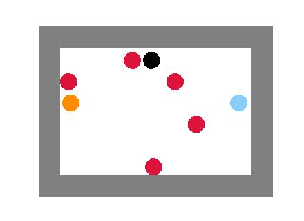
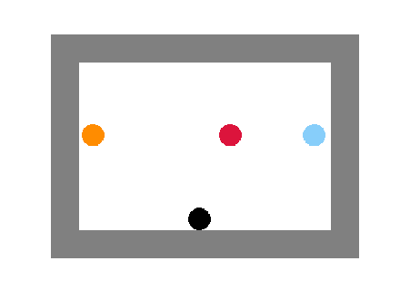
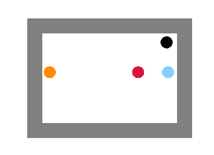

## Explanation:

## Basketball game enviroment:

Env( court_width, court_height, opponent_number=0, opponent_can_move=0, drunk_mode=0 )

Parameters:

* court_width: Integer, The width of court
* court_width: Integer, The height of court
* opponent_number: Integer, The number of opponent in this scenario
* opponent_can_move: Boolean, if it's True, opponent will be randomly distributed in every episode.
* drunk: Boolean, if it's True, then there's chance that the player will move two cells instead of one.

We should notice that, because we need to give the leaving-playing-field penalty, so I added the outter court margin, so the actual size will be: (court_width+margin*2, court_height+margin*2)

We could use the env as follow:
```
import Env from env
env = Env(36,24,250,0,1) # 36*24 court
```

### Warning:
When you set the `opponent_can_move` parameter as `True`, the training model will be HUGE. 
Because we need to record the opponent state (x,y) in the Q matrix, every opponent will take 2 dimension, and each dimension will be the length of width and height.
For example, when we have a 9*6 court (the world will be 11*8), 2 opponent. The Q matrix's shape will be:
```
11(player's x), 8(player's y), 11(ball's x), 8(ball's y), 11(opponent_1's x) * 8(opponent_1's y) * 11(opponent_1's x) * 8(opponent_1's y) * 5(action space)
```


## Finding:

### 9*6 court with 5 opponents won't move:
When the eplison was setting as 0.7, it takes 400,000 episode to trained and had a good result.


### 9*6 court with 1 opponents can move:
When the eplison was setting as 0.7, it needs 1,000,000 episode to trained and had a good result.
But the model can deal with 1 opponent in any position.
#### Test 1:

#### Test 2:

#### Test 3:


### 

## References:
* http://incompleteideas.net/book/first/ebook/node78.html
* https://towardsdatascience.com/reinforcement-learning-temporal-difference-sarsa-q-learning-expected-sarsa-on-python-9fecfda7467e
* https://zhuanlan.zhihu.com/p/26985029
* https://www.zhihu.com/question/26408259
* https://blog.techbridge.cc/2017/11/04/openai-gym-intro-and-q-learning/