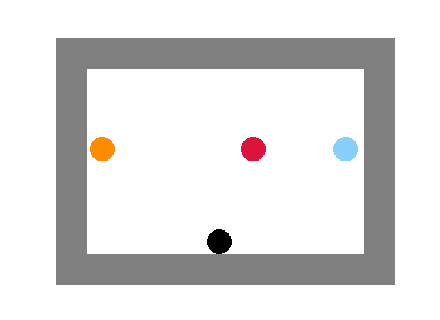

# Finding:

## 9*6 court with 5 opponents:
After training 20k episodes, the performance is good, having about 80~90% chance to score. (Alpha=0.2, gamma=0.8, epsilon=0.7 )

## 12*9 court with 50 opponent:
After training 5M episodes, the performance is still poor, had only half chance to score. ( Alpha=0.2,gamma=0.8, epsilon=0.7 )
⁨

## 36*24 court with 50 opponent:
Sorry my computer can not handle that kind of compute, so I didn't do it...

## 9*6 court with 1 opponents that change in every episode:
When the epsilon was setting as 0.7, it needs 1,000,000 episode to trained. But the model can deal with 1 opponent in any position. Following are some test results using the same trained model:
### Test 1:

### Test 2:

### Test 3:

Player successfully scored 10 times out of 10.